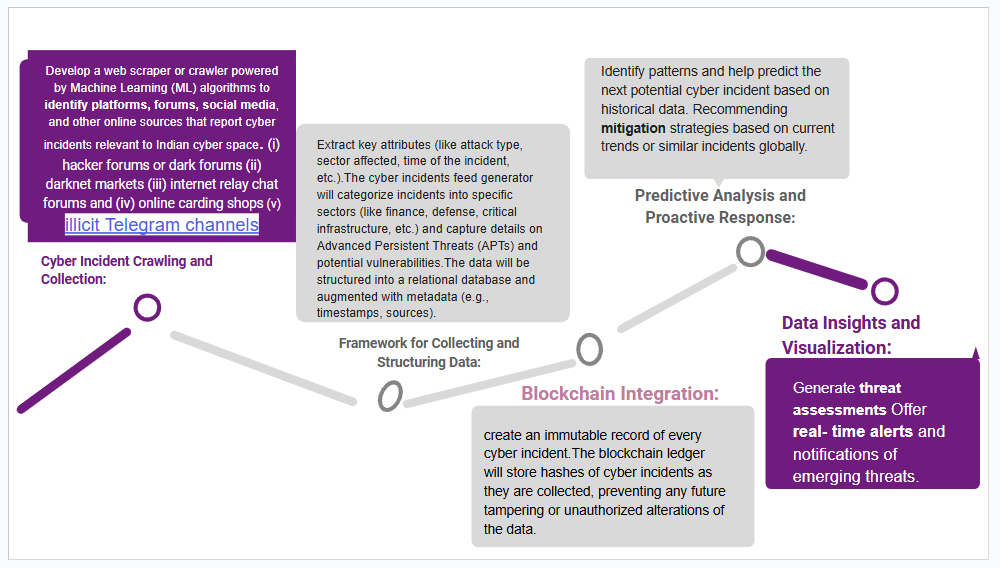

__Welcome to Our repository__
__In order to achieve objective of protecting Critical Information Infrastructure (CIIs) , it is very vital to have real time information related to cyber threats and incidents specific to Indian Cyber space. This may enhance the Threat Assessment potential based on the incidents that have already happened or the ones that currently exists.__

